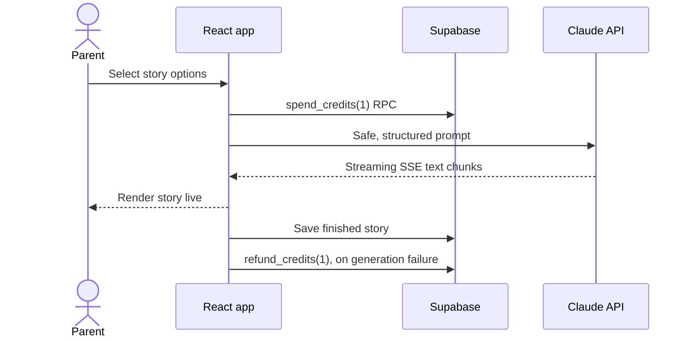

# Bedtime Stories — LinkedIn launch kit

## Post: ready to publish

**What if bedtime stories could be as personal as the child hearing them? 🌙**

I built **Bedtime Stories** — an AI-powered web app that creates gentle, personalised stories for children aged 2–12.

A parent can choose the child’s name, age, language, tone, genre, story length and extras like a rhyme, riddle or moral. The story then streams onto the screen in real time and can be read aloud in the browser.

What I’m especially proud of is that this is more than a prompt box:

• Google sign-in and individual user profiles
• Supabase-backed story history and credit balances
• Secure, database-enforced credit deductions and refunds
• Razorpay checkout with server-side signature verification
• A small admin CRM for user activity, purchases, credits and tiers
• PWA support, local drafts and browser-native voice playback

The stack: **React + Vite, Supabase, Anthropic Claude, Razorpay and Vercel serverless functions.**

Building it taught me that a useful AI product is not just “call an LLM.” It is product design, safe prompting, streaming UX, identity, payments, data access rules and graceful failure handling working together.

I’d love feedback from parents, builders and anyone working on thoughtful AI products for families: what feature would make story time more magical for you?

#BuildInPublic #AI #React #Supabase #WebDevelopment #EdTech #GenerativeAI #ProductDevelopment

## Suggested carousel order

1. `linkedin-assets/01-landing-page.png` — the product promise and landing page.
2. `linkedin-assets/02-story-creator.png` — the personalisation controls.
3. `linkedin-assets/03-mobile-landing.png` — responsive, installable PWA experience.
4. `linkedin-assets/architecture-diagram.svg` — the technical architecture.

For the strongest LinkedIn carousel, add a short title in LinkedIn/Canva above each image: **“I built an AI bedtime-story generator”**, **“Personalised for each child”**, **“Built for mobile”**, and **“The system behind it.”**

## Technical walkthrough: how to explain it confidently

### 30-second explanation

“It is a React PWA that lets signed-in users configure a children’s story. The client turns those choices into a constrained prompt and streams Claude’s response with Server-Sent Events, so text appears immediately. Supabase handles authentication, durable stories, credit balances and an admin CRM. Credits are updated through database functions rather than ordinary client-side updates. Razorpay payments go through Vercel functions, where the payment signature is verified before a service-role Supabase function adds credits.”

### Request lifecycle

### The layers, in plain language

| Layer | Responsibility | Project location |
|---|---|---|
| UI shell | Pages, navigation, modals, local screen state | `src/App.jsx` |
| Identity | Google credential → Supabase session → profile/credits | `src/hooks/useAuth.js`, `components/Auth/GoogleAuth.jsx` |
| Story creation | Form options become a safe prompt | `StoryForm.jsx`, `utils/promptBuilder.js` |
| AI streaming | Calls Claude and parses server-sent events incrementally | `services/api.js`, `StoryOutput.jsx` |
| Data layer | Stories, profile reads and database RPCs | `services/supabaseApi.js` |
| Database security | Tables, RLS policies, triggers and credit/admin RPCs | `supabase/schema.sql` |
| Payments | Create order, verify HMAC signature, credit account | `api/create-order.js`, `api/verify-payment.js` |
| PWA/device features | Cache shell, install flow, TTS, local drafts | `public/sw.js`, `AudioPlayer.jsx`, `storage.js` |

### Technical concepts worth learning next

1. **Server-Sent Events (SSE):** a one-way HTTP stream. Here it lets the story appear token by token rather than making the user wait for the full response.
2. **Optimistic UI:** the credit badge is updated immediately, then reconciled against the database’s authoritative result. It feels responsive without trusting the browser as the final source of truth.
3. **Database RPCs:** `spend_credits`, `refund_credits` and admin functions run inside Postgres. They make a balance update and its audit transaction atomic.
4. **Row Level Security (RLS):** Supabase policies ensure regular users can only read and change their own records, while `is_admin()` expands access for authorised admins.
5. **Server-side payment verification:** Razorpay returns a signature; Vercel verifies it with the secret before crediting the account. A successful-looking browser callback alone is never proof of payment.
6. **PWA:** the service worker caches the app shell for faster repeat visits and enables installation. It does not make live AI generation available offline.
7. **Browser TTS:** `speechSynthesis` is inexpensive and private, but voice quality and behaviour vary by browser and operating system.

### Strong technical talking points

- “The database—not React state—is the source of truth for credits.”
- “The product streams rather than polls; that makes generation feel immediate.”
- “Payment secrets and verification stay in serverless functions.”
- “The schema stores an audit trail of every credit change in `credit_transactions`.”
- “The admin CRM deliberately uses the same protected Supabase data model as the product.”

### Next architecture improvements to discuss honestly

- Move the Anthropic call behind a server-side endpoint so the API key never reaches the browser, and add rate limiting and usage logging there.
- Have the payment verification endpoint derive the amount and credit pack from the Razorpay order metadata instead of accepting client-provided `amount` and `credits` values.
- Update the privacy policy: the app currently saves completed story text in Supabase, so it should not state that story data never leaves the device.
- Add automated tests around database functions, payment verification and failed-stream refunds.

## One-line project description

“Bedtime Stories is a React PWA that streams safe, personalised children’s stories and combines Supabase-authenticated accounts, auditable credit economics, browser voice playback and Razorpay payments.”
